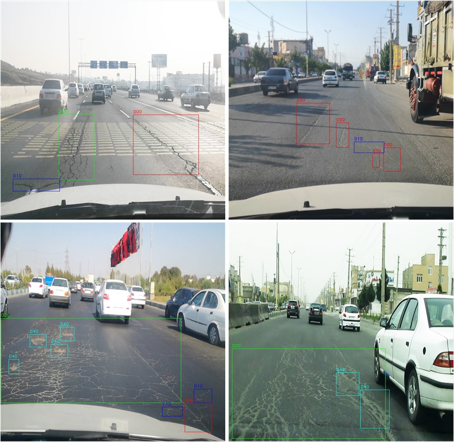

# Iran Road Damage Dataset (IRRDD)
This repository contains the documentation and download links for the 2022 Iran road damage dataset (IRRDD). 
## 1. Descriptions 
  1. IRRDD contains 25000 images.
  2. IRRDD contains for damage class
  3. All annotation are provided in YOLO format.
  
  | Damage type  | Class name |
  | ------------- | ------------- |
  | Longitudinal crack | D00  |
  | Lateral crack  | D10  |
  | Alligator crack  | D20  |
  | Pothole  | D40  |

## 2. Download links

- Data [part 1](https://drive.google.com/file/d/1iAPvA5wiieF0Gdbeu2VqdghHZclsetu8/view?usp=sharing),[part2(ttps://drive.google.com/file/d/1fA2wEJql_YrxgN0J8NCNmWLjFHgCYfYT/view?usp=sharing),[part3](https://drive.google.com/file/d/1PM9VPtDvmsviTg-9LJ2opcWBYwDKavv8/view?usp=sharing),[part4](https://drive.google.com/file/d/1OX0N0RXIGwEsjA9fObZh7k96eP17Mj_3/view?usp=sharing),[part5]ttps://drive.google.com/file/d/1FiV-Q_cK4ANcUBoJt__DKQcph7CRxIQP/view?usp=sharing),[part6] (https://drive.google.com/file/d/15x3cCPgZCHL_aOaFGAY4Zkcrx0EjS8_1/view?usp=sharing)
- 
## 3. Image Samples

<p align="center"></p>

## 4. Citations
If you find this repository helpful and decided to utilize IADD in your research project, consider citing us as below:
```bibtex
@INPROCEEDINGS{iadd,
  author={},
  booktitle={}, 
  title={}, 
  year={2022},
  volume={},
  number={},
  pages={},
  doi={}}
```
